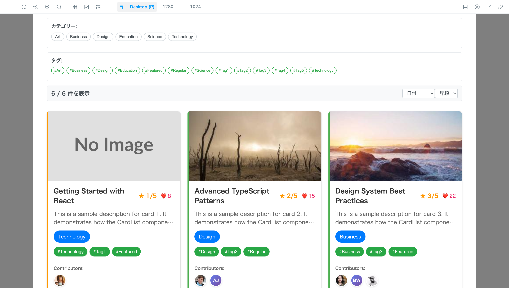
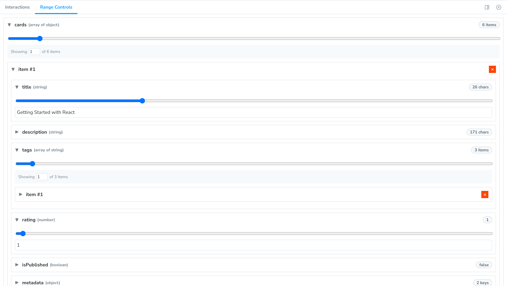

[](https://develop--689dd119bb72c220c0ddb738.chromatic.com/)

# Storybook Addon Range Controls

Storybook Addon Range Controls lets you discover layout issues by adjusting story args with sliders.

## [DEMO](https://develop--689dd119bb72c220c0ddb738.chromatic.com)




## Motivation

Originally, I used Storybook’s built-in `argTypes` with `type: "range"` sliders to check design variations.  
This was great for interactively testing data growth and reduction.

However, setting it up often required extra boilerplate code.  
For simple primitives like strings and numbers, it wasn’t a big issue, but for more complex structures—such as **arrays of nested objects** (e.g., tags inside a card)—I found myself writing the same setup code repeatedly.

That repetitive overhead was what motivated me to create this addon:  
a simpler way to configure sliders for **strings, numbers, image, and arrays** to stress-test UIs more easily.

## Installation

```bash
npm install --save-dev storybook-addon-range-controls
```

Then, register it as an addon in `.storybook/main.js`.

```ts
// .storybook/main.js

// Replace your-framework with the framework you are using (e.g., @storybook/react, @storybook/nextjs)
// Note: This addon currently supports React based Storybook projects.
import type { StorybookConfig } from "@storybook/react";

const config = {
  // ...rest of config
  addons: [
    "@storybook/addon-docs",
    "storybook-addon-range-controls", // 👈 register the addon here
  ],
};

export default config;
```

## Usage

The primary way to use this addon is to define the `range` parameter. You can do this the
component level, as below, to affect all stories in the file, or you can do it for a single story.

```ts
// Card.stories.ts

// Replace your-framework with the framework you are using (e.g., @storybook/react, @storybook/nextjs)
import type { Meta } from "@storybook/your-framework";

import { Card } from "./Card";

const meta: Meta<typeof Card> = {
  component: Card,
  parameters: {
    range: {
      // See API section below for available parameters
    },
  },
};

export default meta;
```

## API

This addon contributes a `range` parameter to Storybook, defined using **PropConfig** objects.

```ts
export type StringPropConfig = {
  type: "string";
  min?: number;
  max?: number;
  step?: number;
  defaultChar?: string;
};

export type NumberPropConfig = {
  type: "number";
  min?: number;
  max?: number;
  step?: number;
};

export type ArrayPropConfig = {
  type: "array";
  min?: number;
  max?: number;
  step?: number;
  items?: PropConfig;
  defaultItem?: any | ((index: number) => any);
};

export type ImagePropConfig = {
  type: "image";
  width?: {
    min?: number;
    default?: number;
    max?: number;
    step?: number;
  };
  height?: {
    min?: number;
    default?: number;
    max?: number;
    step?: number;
  };
  src?: ({ width, height }: { width?: number; height?: number }) => string;
};

export type BooleanPropConfig = {
  type: "boolean";
};

export type EnumPropConfig = {
  type: "enum";
  selection?: "single" | "multiple";
  options?: string[] | number[] | { label: string; value: any }[];
};

export type ObjectPropConfig = {
  type: "object";
} & {
  [K in string as K extends "type" ? never : K]: PropConfig;
};

export type PropConfig =
  | StringPropConfig
  | NumberPropConfig
  | ArrayPropConfig
  | ImagePropConfig
  | BooleanPropConfig
  | EnumPropConfig
  | ObjectPropConfig;

export type PropConfigs = {
  [key: string]: PropConfig;
};
```

### Configuration

The `range` parameter accepts the following configuration options.

| type      | description                                   | options                                      |
| --------- | --------------------------------------------- | -------------------------------------------- |
| `string`  | Adjust string length via a slider             | `min`, `max`, `step`, `defaultChar`          |
| `number`  | Adjust a numeric value via a slider           | `min`, `max`, `step`                         |
| `array`   | Adjust array length via a slider              | `min`, `max`, `step`, `items`, `defaultItem` |
| `image`   | Adjust image width/height via a slider        | `width`, `height`, `src`                     |
| `enum`    | Enum with single or multiple selection        | `selection`, `options`                       |
| `boolean` | Toggle true/false                             | —                                            |
| `object`  | Nested fields, each defined by its own `type` | —                                            |

---

#### Common options (`string`, `number`, `array`)

| key    | type     | default | description                |
| ------ | -------- | ------- | -------------------------- |
| `min`  | `number` | `0`     | Minimum value of the range |
| `max`  | `number` | `100`   | Maximum value of the range |
| `step` | `number` | `1`     | Step interval              |

#### `string` only

| key           | type     | default | description                                   |
| ------------- | -------- | ------- | --------------------------------------------- |
| `defaultChar` | `string` | `"x"`   | Character used when padding length via slider |

#### `array` only

| key           | type                              | description                                                     |
| ------------- | --------------------------------- | --------------------------------------------------------------- |
| `items`       | `PropConfig`                      | Definition of element type.                                     |
| `defaultItem` | `any` \| `(index: number) => any` | Default element value. Can be fixed or generated by a function. |

#### `image` only

| key      | type                            | description                                                                  |
| -------- | ------------------------------- | ---------------------------------------------------------------------------- |
| `width`  | `{ min, default, max, step }`   | Slider settings for width. Defaults: `default=300, min=50, max=800, step=1`  |
| `height` | `{ min, default, max, step }`   | Slider settings for height. Defaults: `default=200, min=50, max=800, step=1` |
| `src`    | `({ width, height }) => string` | Custom URL generator. Defaults to `https://placehold.co/{width}x{height}`    |

#### `enum` only

| key         | type                                                          | description                                           |
| ----------- | ------------------------------------------------------------- | ----------------------------------------------------- |
| `selection` | `"single"` \| `"multiple"`                                    | Single or multiple selection                          |
| `options`   | `string[]` \| `number[]` \| `{ label: string; value: any }[]` | List of options. Supports arrays of label/value pairs |

#### `object` only

Define nested fields, each with its own `type`:

```ts
{
  type: "object",
  name: { type: "string" },
  price: { type: "number" }
}
```

### Examples

Configure `range` on a story (or per-file) to control strings, numbers, arrays, enums, booleans, and nested objects with interactive controls.

```tsx
// Card.stories.ts
import type { Meta } from "@storybook/your-framework";
import { Card } from "./Card";

const meta: Meta<typeof Card> = {
  component: Card,

  parameters: {
    range: {
      // string
      title: { type: "string", min: 0, max: 50, step: 5 },
      subtitle: { type: "string", min: 0, max: 30, step: 1, defaultChar: "·" },

      // number
      likes: { type: "number", min: 0, max: 999, step: 1 },

      // boolean
      featured: { type: "boolean" },

      // array of primitives
      tags: {
        type: "array",
        min: 0,
        max: 5,
        step: 1,
        items: { type: "string" },
        defaultItem: (i: number) => `tag-${i + 1}`,
      },

      // array of objects
      users: {
        type: "array",
        min: 1,
        max: 3,
        items: {
          type: "object",
          name: { type: "string", min: 0, max: 20 },
          age: { type: "number", min: 0, max: 120, step: 1 },
        },
        defaultItem: { name: "Alice", age: 20 },
      },

      // image
      thumbnail: {
        type: "image",
        width: { min: 100, default: 300, max: 600, step: 10 },
        height: { min: 100, default: 200, max: 400, step: 10 },
        src: ({ width, height }) =>
          `https://picsum.photos/${width}/${height}?random=1`,
      },

      // enum (single)
      size: {
        type: "enum",
        selection: "single",
        options: ["sm", "md", "lg"],
      },

      // enum (multiple)
      colors: {
        type: "enum",
        selection: "multiple",
        options: [
          { label: "Red", value: "#f00" },
          { label: "Green", value: "#0f0" },
          { label: "Blue", value: "#00f" },
        ],
      },

      // object with nesting
      product: {
        type: "object",
        name: { type: "string" },
        price: { type: "number", min: 0, max: 1000, step: 10 },

        specs: {
          type: "object",
          weight: { type: "number", min: 0, max: 5000, step: 50 },
        },
      },
    },
  },
};

export default meta;
```
